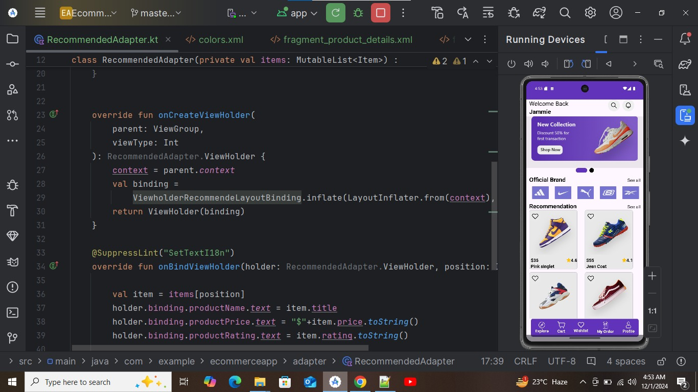

<p align="center">
  
  <br />
  An Ecommerce Android App, in Kotlin
  <br />
  <a href="https://github.com/champvikash/Ecommerce-Android-App/tree/v-1.0/app/release/latest">
    <strong>Download app »</strong>
  </a>
  <br />
  <br />
  
  <a href="https://github.com/champvikash/Ecommerce-Android-App/issues">Request Feature</a>
</p>


### Built with

- [Android Studio](https://developer.android.com/studio)
- [Kotlin](https://kotlinlang.org)
- [Retrofit](https://square.github.io/retrofit)
- Coroutines
- MVVM Architecture
- Android Architecture Components


## Getting started

### Prerequisites

Install [Android Studio](https://developer.android.com/studio)

### Setup

1. Clone the project to your local machine

```bash
git clone https://github.com/champvikash/Ecommerce-Android-App.git
```

2. Open the project in Android Studio

   
## Development

1. Select the device that you want to run the app

2. Click **Run**

## Contributing

Contributions are what make the open source community such an amazing place to learn, inspire, and create. Any contributions you make are **greatly appreciated**.

1. Fork the project
2. Create your feature branch (`git checkout -b feature/amazing-feature`)
3. Commit your changes (`git commit -m 'feat: add some amazing feature'`)
4. Push to the branch (`git push origin feature/amazing-feature`)
5. Open a pull request


## Author
- [Vikash](https://github.com/champvikash)


